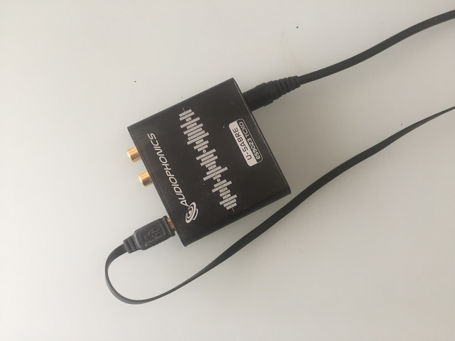
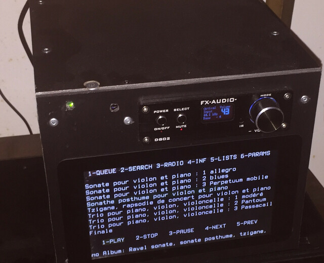

Work in progress
==============

But
==============
Faire une chaîne Audiophile à base de Raspberry Pi.
- écouter morceaux enregistrés sur un disque dur local
- écouter radios

Avec un écran Touchscreen sans utiliser l'écran tactile (ne fonctionne plus).

Taille de l'écran : 50x15 pour avoir de gros caractères visibles de loin.

Contrôle avec une télécommande IR simplifiée (juste quelques boutons)

-> Tentatives pour utiliser ncmpc ou ncmpcpp (et plusieurs autres clients mpc) mais impossible de les contrôler par IR (trop complexe de gérer les différentes popups avec seulement quelques boutons de la télécommande).

Matériel
==============
Raspberry Pi 3B+
-----------------

Ecran Tactile Officiel 7" 800x480 Touchscreen
-----------------
Terminal 100x30

RemotePi Board for Pi 3B and Pi 3B+
-----------------
https://www.msldigital.com/collections/all-products/products/remotepi-board-for-pi-3

Pour pouvoir allumer, éteindre, contrôler le Raspberry par IR

DAC U-SABRE
-----------------
https://www.audiophonics.fr/fr/dac-sans-volume/audiophonics-u-sabre-usb-dac-24bit96khz-sa9023-es9023-otg-v22e-tcxo-edition-p-11056.html

Ampli FX-AUDIO
-----------------
https://www.audiophonics.fr/fr/amplificateur-full-digital-fda/fx-audio-d802c-pro-amplificateur-fda-bluetooth-42-nfc-class-d-sta326-2x80w-4-ohm-noir-p-12850.html

Télécommande standard
-----------------

Un disque SSD 512 Go pour stocker la musique
-----------------

La chaine une fois assemblée :
-----------------

Installation
==============

Installer Raspbian
-----------------
Raspberry Pi OS (32-bit) Lite

Installer mpd

[Liste des packages installés](./install/packages.txt)

Configuration de l'écran, terminal 50x15
-----------------

    # cat /etc/default/console-setup
    ...
    FONTFACE="Terminus"
    FONTSIZE="16x32"
    ...

    # etc/init.d/console-setup.sh restart

Faire tourner l'écran si besoin
-----------------

    # cat /boot/config.txt
    ...
    lcd_rotate=2
    ...

Configuration IR
-----------------

    # cat /boot/config.txt
    ...
    dtoverlay=gpio-ir
    ...

    apt install ir-keytable
    apt install inputlirc lirc

Connaître le /dev/sys utilisé

    # ir-keytable
    Found /sys/class/rc/rc0/ (/dev/input/event1) with:
    Name: gpio_ir_recv
    Driver: gpio_ir_recv, table: rc-rc6-mce
    LIRC device: /dev/lirc0
    Attached BPF protocols: Fonction non implantée
    Supported kernel protocols: lirc rc-5 rc-5-sz jvc sony nec sanyo mce_kbd rc-6 sharp xmp imon
    Enabled kernel protocols: lirc nec
    bus: 25, vendor/product: 0001:0001, version: 0x0100
    Repeat delay = 500 ms, repeat period = 125 ms

Initialiser un protocole IR

    # cat /sys/class/rc/rc0/protocols
    rc-5 nec rc-6 jvc sony rc-5-sz sanyo sharp mce_kbd xmp imon [lirc]
    # echo nec > /sys/class/rc/rc0/protocols
    # cat /sys/class/rc/rc0/protocols
    rc-5 [nec] rc-6 jvc sony rc-5-sz sanyo sharp mce_kbd xmp imon [lirc]

    ir-keytable -p <protocole>

Tester les événements IR avec la télécommande

    ir-keytable -t

Générer le fichier /etc/rc_keymaps/meliconi_tlc02.toml (correspondant à la télécommande) avec les bonnes touches.

    # cat /etc/rc_keymaps/meliconi_tlc02.toml
    [[protocols]]
    name = "meliconi_tlc02"
    protocol = "nec"
    [protocols.scancodes]
    0x411 = "KEY_1"
    0x414 = "KEY_4"
    0x417 = "KEY_7"
    0x453 = "KEY_LIST"
    0x403 = "KEY_MINUS"
    0x443 = "KEY_MENU"
    0x420 = "KEY_TEXT"
    0x407 = "KEY_LEFT"
    0x428 = "KEY_BACK"
    0x491 = "KEY_ADDRESSBOOK"
    0x495 = "KEY_SAVE"
    0x48f = "KEY_PREVIOUS"
    0x472 = "KEY_R"
    0x40b = "KEY_SCREEN"
    0x412 = "KEY_2"
    0x415 = "KEY_5"
    0x418 = "KEY_8"
    0x410 = "KEY_0"
    0x41e = "KEY_FAVORITES"
    0x409 = "KEY_MUTE"
    0x47c = "KEY_HOME"
    0x440 = "KEY_UP"
    0x444 = "KEY_M"
    0x441 = "KEY_DOWN"
    0x479 = "KEY_R"
    0x4b0 = "KEY_PLAY"
    0x471 = "KEY_G"
    0x4f0 = "KEY_RADIO"
    0x413 = "KEY_3"
    0x416 = "KEY_6"
    0x419 = "KEY_0"
    0x41a = "KEY_O"
    0x400 = "KEY_CHANNELUP"
    0x401 = "KEY_CHANNELDOWN"
    0x445 = "KEY_CONTEXT_MENU"
    0x421 = "KEY_N"
    0x406 = "KEY_RIGHT"
    0x45b = "KEY_EXIT"
    0x4aa = "KEY_INFO"
    0x4bd = "KEY_RECORD"
    0x4ba = "KEY_PAUSE"
    0x463 = "KEY_Y"
    0x439 = "KEY_SUBTITLE"
    0x4b1 = "KEY_STOP"
    0x48e = "KEY_X"
    0x461 = "KEY_B"

Ajouter dans /etc/rc.local

    # cat /etc/rc.local
    ...
    ir-keytable -c -w /etc/rc_keymaps/meliconi_tlc02.toml --sysdev rc0
    ...

    # cat /etc/default/inputlirc
    # Options to be passed to inputlirc.
    EVENTS="/dev/input/event0"
    OPTIONS="-g -m 0 -c"
    # EVENTS="/dev/input/event*"
    # OPTIONS=

Configuration des touches
-----------------

    pi@host:~ $ cat .local/share/mpcrust/keys.json
    [65, 66, 68, 67, 38, 169, 34, 39, 40, 45, 168, 95, 97, 160, 44, 110, 114, 103, 121, 98]

Correspond à : TouchUp, TouchDown, TouchLeft, TouchRight, Touch1, Touch2, Touch3, Touch4, Touch5, Touch6, Touch7, Touch8, Touch9, Touch0, TouchPlay, TouchOk, TouchRed, TouchGreen, TouchYellow, TouchBlue, TouchNone

Configurer le bouton pour démarrer par IR
-----------------

Voir : [Support for RemotePi Board for Pi 4, RemotePi Board for Pi 3 B+, Pi 3, Pi 2 and Pi 1 B+ , RemotePi Board for Pi 1 Model B](https://www.msldigital.com/pages/support-for-remotepi-board-plus-2015/)

    # cat /etc/rc.local
    ...
    (/etc/irswitch.sh)&
    ...

    # cat /etc/irswitch.sh
    #!/bin/bash
    # this is the GPIO pin receiving the shut-down signal
    GPIOpin1=14
    echo "$GPIOpin1" > /sys/class/gpio/export
    echo "in" > /sys/class/gpio/gpio$GPIOpin1/direction
    while true; do
      sleep 1
      power=$(cat /sys/class/gpio/gpio$GPIOpin1/value)
      if [ $power != 0 ]; then
        echo "out" > /sys/class/gpio/gpio$GPIOpin1/direction
        echo "1" > /sys/class/gpio/gpio$GPIOpin1/value
        sleep 3
        sudo shutdown -h now
      fi
    done

Désactiver WIFI et Bluetooth
-----------------
Pour ceux qui n'aiment pas baigner dans les ondes électromagnatiques

    # cat /boot/config.txt
    ...
    dtoverlay=disable-bt
    dtoverlay=disable-wifi
    ...

    # sudo systemctl disable hciuart.service
    # sudo systemctl disable bluealsa.service
    # sudo systemctl disable bluetooth.service

    # sudo apt-get purge bluez -y
    # sudo apt-get autoremove -y

Monter la partition de musique
-----------------

Le disque /dev/sda1 contient la musique (répertoires + morceaux). On monte directement le répertoire de musique par défaut de mpd sur la racine du disque.

    # cat /etc/fstab
    ...
    /dev/sda1 /var/lib/mpd/music exfat defaults,nofail 0 0
    ...

    # mount /dev/sda1 /var/lib/mpd/music

Pare-feu basique
-----------------

    # cat /etc/init.d/packetfilter
    #!/bin/bash

    ### BEGIN INIT INFO
    # Provides:          packetfilter
    # Required-Start:    $remote_fs $syslog
    # Required-Stop:     $remote_fs $syslog
    # Default-Start:     2 3 4 5
    # Default-Stop:      0 1 6
    # Short-Description: Démarre les règles iptables
    # Description:       Charge la configuration du pare-feu iptables
    ### END INIT INFO

    # Script de controle du filtrage ip.

    PATH=/bin:/sbin:/usr/sbin:/usr/bin

    case "$1" in
        start)
        echo -n "Turning on packet filtering:"

        # Par defaut
        iptables -F
        iptables -X
        iptables -t nat -F
        iptables -t nat -X
        iptables -P INPUT ACCEPT
        iptables -P OUTPUT ACCEPT
        iptables -P FORWARD DROP

        # Connections etablies
        iptables -A INPUT -m state --state ESTABLISHED,RELATED -j ACCEPT

        # Ssh depuis l'exterieur
        iptables -A INPUT -p tcp -i eth0 --dport 22 -j ACCEPT

        # ICMP
        iptables -A INPUT -p icmp -i eth0 -j ACCEPT

        # On bloque le reste pour eth0
        iptables -A INPUT -i eth0 -j DROP

        echo "."
        ;;
        stop)
        echo -n "Turning off packet filtering:"
        iptables -F
        iptables -X
        iptables -t nat -F
        iptables -t nat -X
        iptables -P INPUT ACCEPT
        iptables -P OUTPUT ACCEPT
        iptables -P FORWARD DROP
        echo "."
        ;;
        restart)
        $0 stop
        sleep 2
        $0 start
        ;;
        *)
        echo "Usage: /etc/init.d/packetfilter {start|stop|restart}"
        exit 1
        ;;
    esac

    # update-rc.d packetfilter defaults
    # /etc/init.d/packetfilter start

Lancer mpcrust
-----------------

Compiler mpcrust sur le raspberry (pas de chaine de crosscompilation à mettre en place).

    pi@host:~ cd mpcrust
    pi@host:~ cargo build release
    pi@host:~ cat /home/pi/.bashrc
    ....
    /home/pi/launchmpcrust.sh

    pi@host:~ cat /home/pi/launchmpcrust.sh
    #!/bin/sh

    /home/pi/mpcrust/target/release/mpcrust

Radios
==============
http://dir.xiph.org/yp.xml

    telnet ice2.ikoula.net-radio.fr 80
    GET frequence3.flac HTTP1/1
    Hostname: ice2.ikoula.net-radio.fr

Utilisation
==============

